

  

**[Live Platform →](https://verdexai-official.vercel.app)**&ensp;|&ensp;**[Back to README →](./README.md)**

---

## Table of Contents

- [Introduction](#introduction)
- [Getting Started](#getting-started)
  - [Creating an Account](#creating-an-account)
  - [Logging In](#logging-in)
  - [Forgot Password](#forgot-password)
- [Candidate Guide](#candidate-guide)
  - [Dashboard Overview](#candidate-dashboard-overview)
  - [Browsing Jobs](#browsing-jobs)
  - [Applying to a Job](#applying-to-a-job)
  - [My Tests](#my-tests)
  - [Taking an Assessment Test](#taking-an-assessment-test)
  - [Viewing Test Results](#viewing-test-results)
  - [Interview Details](#interview-details)
  - [Onboarding](#candidate-onboarding)
- [HR Guide](#hr-guide)
  - [Dashboard Overview](#hr-dashboard-overview)
  - [Creating a Job Post](#creating-a-job-post)
  - [Managing Job Posts](#managing-job-posts)
  - [Ranked Candidates](#ranked-candidates)
  - [Sending Assessment Tests](#sending-assessment-tests)
  - [Scheduling Interviews](#scheduling-interviews)
  - [Finalizing a Hire](#finalizing-a-hire)
  - [Onboarding Management](#onboarding-management)
- [Admin Guide](#admin-guide)
  - [Admin Dashboard](#admin-dashboard)
  - [Managing HR Accounts](#managing-hr-accounts)
- [Contact & Support](#contact--support)

---
## Introduction

VerdexAI is an AI-powered recruitment platform that streamlines the entire hiring process from posting a job to onboarding a hired candidate using intelligent CV parsing, automated scoring, assessment testing, and interview scheduling.

### Who is this guide for?

| Role | Description |
|------|-------------|
| **Candidate** | Job seekers who apply to positions, take assessments, and track their applications |
| **HR / Recruiter** | Hiring managers who post jobs, review AI-ranked candidates, and manage the hiring pipeline |
| **Admin** | Platform administrators who manage HR accounts and view system statistics |

---

## Getting Started

### Creating an Account

1. Visit [https://verdexai-official.vercel.app](https://verdexai-official.vercel.app)
2. Click **Sign Up** in the navigation bar ***See the screenshot below ↓***

  

3. Fill in the registration form:
   - **Full Name** — your real name
   - **Email** — a valid email address you have access to
   - **I am a** — select your role:
     - **Candidate** — if you are looking for a job
     - **HR / Recruiter** — if you are hiring
   - **Password** — minimum 8 characters (use the strength indicator as a guide)
   - **Confirm Password** — must match exactly  ***See the screenshot below ↓***

  

  

4. Click **Sign Up**
5. You will be automatically redirected to your role-specific dashboard

> **Note:** *Admin accounts are not self-registered. Contact the platform owner if you need admin access.*

--- 

### Logging In

1. Click **Sign In** in the navigation bar
2. Enter your registered email and password
3. Click **Sign In**
4. You will be redirected to your dashboard based on your role:
   - **Candidate** → `/candidate/dashboard`
   - **HR** → `/hr/dashboard`
   - **Admin** → `/admin/hr`

  

---

### Forgot Password

1. On the login page, click **Forgot password?**
2. Enter your registered email address
3. Click **Send Reset Link**
4. Check your inbox for a password reset email from VerdexAI
5. Click the link in the email and set a new password

  

  

  

---

## Candidate Guide

### Candidate Dashboard Overview

After logging in, you will see your personal dashboard showing:

| Widget | Description |
|--------|-------------|
| **Applications Sent** | Total number of jobs you have applied to |
| **Shortlisted** | Applications where HR has shortlisted you |
| **Interviews** | Scheduled interviews you have upcoming |
| **Hired** | Positions where you have been hired |

Below the stats:
- **Upcoming Interviews** — shows any scheduled interviews with date, time, platform, and meeting link
- **All Applications** — complete list of your applications with current status

  

  
  

---

### Browsing Jobs

1. Click **Browse Jobs** in the left sidebar
2. All open job positions are displayed as cards showing:
   - Job title
   - Department
   - Brief description preview
3. If you have previously applied with a CV, your **AI-Extracted Profile** will appear at the top showing your skills, experience, and education as parsed by the AI

  

  

---
### Applying to a Job

1. On the Browse Jobs page, click **Apply Now** on any job card
2. You will see the full job description and requirements
3. Complete the application form:

   **Upload CV (PDF)**
   - Click the file input and select your resume as a PDF file
   - Maximum file size: 5MB
   - Your CV will be automatically parsed by AI to extract your skills, experience, and education
   - This extracted data is used to generate your match score against the job requirements

   **Cover Letter**
   - Write a personalized cover letter explaining why you are a good fit
   - This is optional but strongly recommended

4. Click **Submit Application**
5. A success message will appear: *"Application submitted! Your CV is being analyzed by AI"*
6. You will be automatically redirected to your dashboard after a few seconds

  
  
  

> **How AI Scoring Works:** Once you submit, VerdexAI sends your CV text and the job requirements to OpenAI. The AI extracts your profile and generates a match score (0–100%) with a reasoning explanation. This score is visible to the HR team on their ranked candidates list.

---

### My Tests

When HR sends you an assessment test, it appears in your **My Tests** section.

1. Click **My Tests** in the left sidebar
2. You will see all test invitations with:
   - Job title
   - Time limit
   - Expiry date
   - Status (Pending / Completed / Expired)
3. Click **Start Test** to begin a pending test  

  

> **Important:** Tests expire after 7 days from when they were sent. Complete them before the expiry date.

---

### Taking an Assessment Test

1. Click **Start Test** on a pending invitation
2. The test opens in a focused interface showing:
   - Job title in the top bar
   - Countdown timer (top right — turns red when under 2 minutes)
   - Tab switch counter (increases if you switch browser tabs)
   - Question progress bar

3. **Answering Questions:**
   - Read the question carefully
   - Click one of the four options (A, B, C, D) to select your answer
   - Selected answers are highlighted in blue
   - Use **Previous** and **Next** buttons to navigate between questions
   - Use the numbered dots below to jump directly to any question
   - Answered questions show as filled dots, unanswered as empty

  

  

4. **Submitting:**
   - Click **Submit Test** on the last question (or any question using the submit button)
   - If you have unanswered questions, a confirmation prompt appears
   - The test auto-submits when the timer reaches zero

5. **Proctoring:** The system tracks how many times you switch browser tabs. Keep the test tab active throughout.

> **Important:** You can only submit a test once. Once submitted, you cannot retake it.

---

### Viewing Test Results

After submitting, you are redirected to the results page showing:

- **Score percentage** — large display (green if ≥60%, red if below)
- **Correct/Total** — e.g. "7 out of 10 correct"
- **Time Taken** — total time you spent
- **Tab Switches** — number of times you switched away from the test tab

Click **Review Answers** to see a detailed breakdown:
- Each question displayed with all four options
- **Correct answer** highlighted in blue with "(Correct)" label
- **Your wrong answers** highlighted in red with "(Your answer)" label
- **Explanation** shown below each question explaining the correct answer

  

---

### Interview Details

When HR schedules an interview, you receive:

1. **Email notification** — sent automatically to your registered email with:
   - Interview date and time (PKT timezone)
   - Duration
   - Platform (Google Meet, Zoom, Microsoft Teams, or Other)
   - Meeting link (clickable)
   - Notes from HR

2. **Dashboard card** — visible in the **Upcoming Interviews** section on your dashboard showing all the same details, with a **Join Meeting** link

  

> **Tip:** Save the meeting link before the interview day. Join 5 minutes early to test your audio and video.

  Candidate Received Email
  

---

### Candidate Onboarding

After being hired, your onboarding checklist becomes visible.

1. Click **Onboarding** in the left sidebar
2. Your onboarding card shows:
   - Role and department you were hired for
   - Start date (if set by HR)
   - Progress bar showing overall completion
   - Individual steps with green checkmarks for completed ones:
     - Offer Letter Sent
     - Offer Accepted
     - Documents Submitted
     - IT Account Setup
     - First Day Scheduled

  

> **Note:** The steps are updated by your HR team. You cannot toggle them yourself — contact HR if there is a discrepancy.

---
## HR Guide

### HR Dashboard Overview

The HR dashboard gives you a real-time overview of your hiring pipeline:

| Stat | Description |
|------|-------------|
| **Active Job Posts** | Jobs you have posted that are currently open |
| **Total Applicants** | All candidates who applied to your jobs |
| **Shortlisted** | Candidates you have marked as shortlisted or interview-scheduled |
| **Hired** | Candidates you have finalized as hired |

Below the stats, your job posts are listed with applicant counts.

  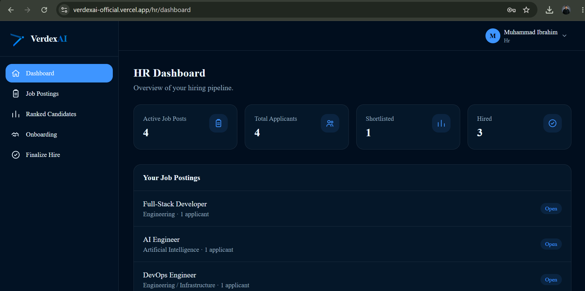

---

### Creating a Job Post

1. Click **Job Postings** in the left sidebar
2. Fill in the **Create New Job Post** form:

   | Field | Description |
   |-------|-------------|
   | **Job Title** | Clear, specific title (e.g. "Python Developer") |
   | **Department** | Department or team (e.g. "Engineering") |
   | **Description** | Full role description — what the candidate will do |
   | **Requirements** | Skills, experience, qualifications required |

3. Click **Publish Job**
4. The job appears immediately in the **Your Job Posts** list below
5. Candidates can now see and apply to this job

  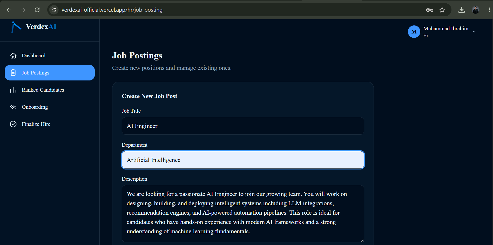
  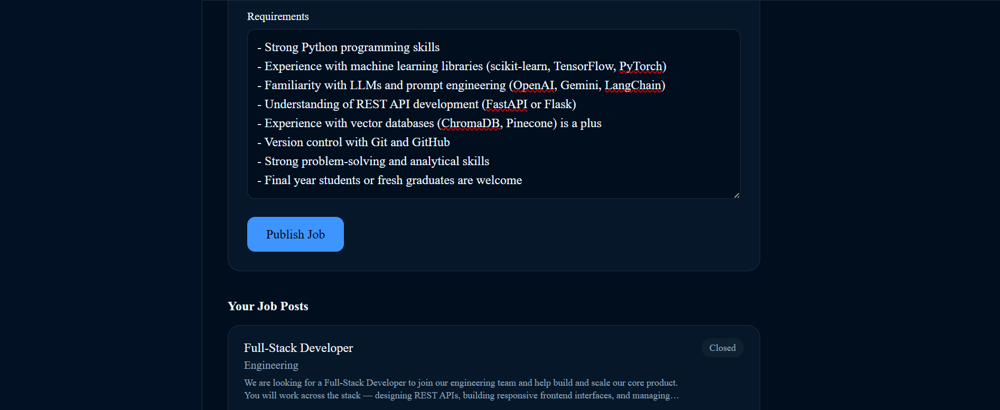
  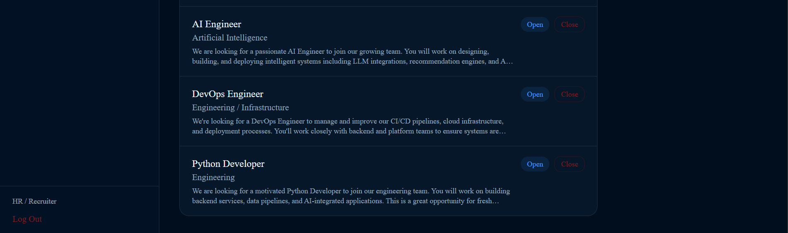

> **Tip:** Be specific in your Requirements section — this is what the AI uses to score and rank candidates against.

---
### Managing Job Posts

Your existing job posts are listed below the creation form.

**To close a job:**
1. Find the job in the list with **Open** status
2. Click **Close** button on the right
3. Confirm in the popup
4. The job status changes to **Closed** and candidates can no longer apply

  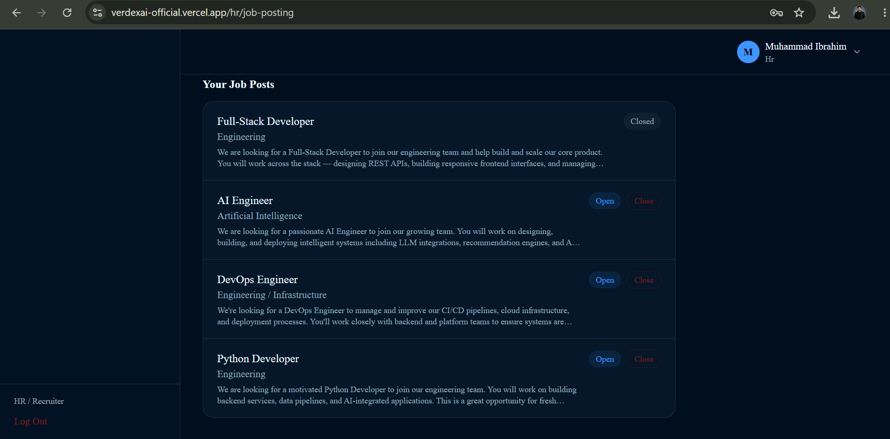

---
---

### Ranked Candidates

This is the core AI-powered feature of VerdexAI.

1. Click **Ranked Candidates** in the sidebar
2. All candidates who applied to your jobs are listed, sorted by AI match score (highest first)
3. Each row shows:
   - Candidate name (extracted from CV by AI)
   - Job they applied to
   - AI score bar and percentage
   - Status dropdown

**Expanding a Candidate:**
Click any candidate row to expand it and see:
- Email address
- AI Reasoning — why they received that score
- Skills — extracted from their CV
- Experience — years of experience detected
- Education — highest qualification found
- Cover Letter — what they wrote
- Test Score badge (if they have completed an assessment test)

  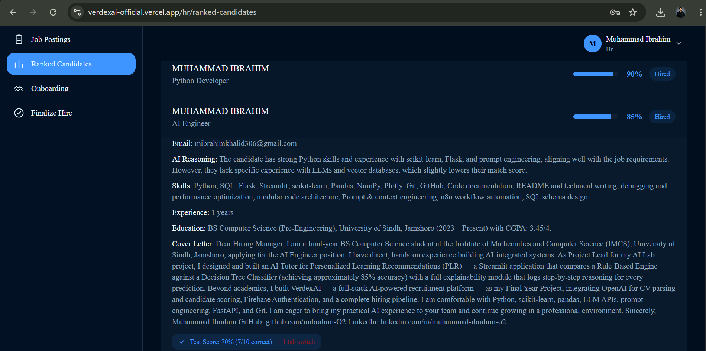

---

**Updating Status:**
Use the dropdown to move a candidate through the pipeline:

| Status | Meaning |
|--------|---------|
| Submitted | Just applied, not yet reviewed |
| Under Review | You are currently evaluating them |
| Shortlisted | You want to proceed with them |
| Interview Scheduled | Interview has been arranged |
| Rejected | Not proceeding with this candidate |

> Changing status to **Interview Scheduled** also sends the candidate an automatic email notification.

---
### Sending Assessment Tests

1. Expand a candidate's row on the Ranked Candidates page
2. Click **Send Assessment Test**
3. VerdexAI automatically:
   - Generates 10 MCQ questions relevant to the job using AI
   - Sends the invitation to the candidate (visible in their My Tests section)
   - Sets a 30-minute time limit and 7-day expiry
4. A success alert confirms the invitation was sent

  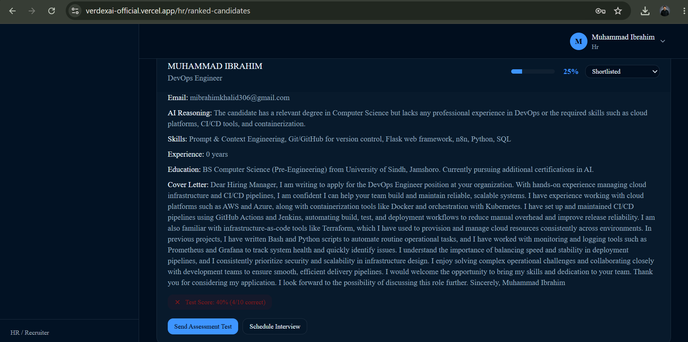

> **Note:** If questions already exist for this job, the same pool is reused. Each job has one shared question pool to ensure consistency.

---

### Scheduling Interviews

1. Expand a candidate's row on the Ranked Candidates page
2. Click **Schedule Interview**
3. A modal opens — fill in the interview details:

   | Field | Description |
   |-------|-------------|
   | **Date & Time** | Pick the interview date and time using the date picker |
   | **Duration** | How long the interview will last (15–120 minutes) |
   | **Platform** | Google Meet, Zoom, Microsoft Teams, or Other |
   | **Meeting Link** | Paste the full meeting URL here |
   | **Notes for Candidate** | Any preparation instructions or information |

4. Click **Schedule & Notify Candidate**
5. The candidate receives an immediate email with all the details
6. The candidate's application status updates to **Interview Scheduled**

  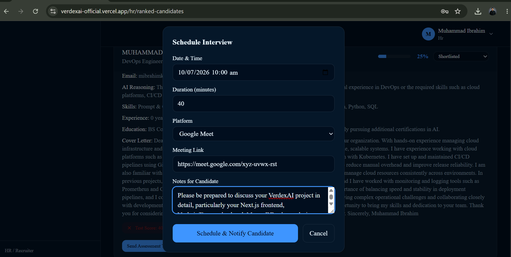

> **Rescheduling:** If you need to change the time, open the Schedule Interview modal again for the same candidate and fill in the new details. The candidate will receive an updated email marked as "Rescheduled."

  

---

### Finalizing a Hire

Once you have decided to hire a candidate:

1. **Prerequisite:** The candidate's status must be **Shortlisted** or **Interview Scheduled** — not just Submitted or Under Review
2. Click **Finalize Hire** in the sidebar
3. Select the candidate from the dropdown
   - Only eligible candidates (shortlisted/interview-scheduled) appear here
4. Set a **Start Date** for when they will join
5. Click **Confirm Hire**
6. The system:
   - Updates the application status to **Hired**
   - Creates an onboarding record for this candidate
   - The candidate now sees the onboarding checklist in their dashboard

  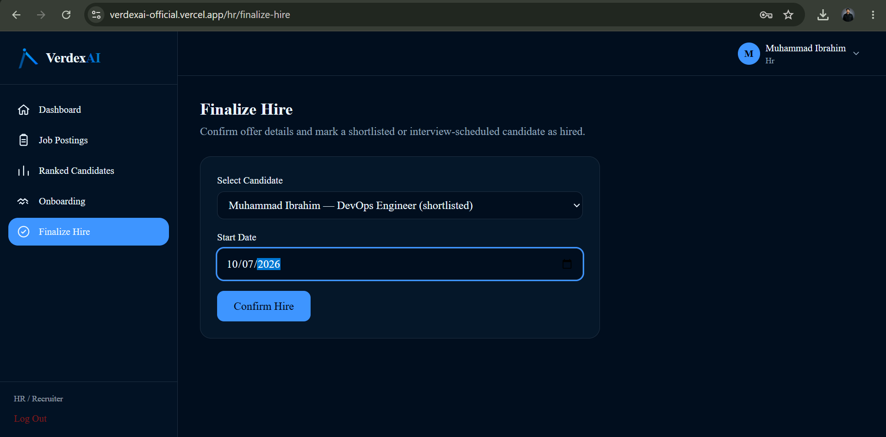

---

### Onboarding Management

After hiring a candidate, track their onboarding progress.

1. Click **Onboarding** in the sidebar
2. Each hired candidate appears as a card showing:
   - Their name and the role they were hired for
   - Start date
   - Progress bar (X/5 steps done)
   - Five onboarding steps as clickable buttons

3. **Click any step to toggle it complete/incomplete:**
   - Offer Letter Sent
   - Offer Accepted
   - Documents Submitted
   - IT Account Setup
   - First Day Scheduled

4. The progress bar updates in real time
5. The candidate can see the same steps and progress on their Onboarding page

  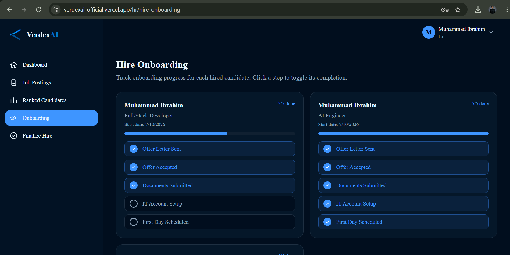

---

## Admin Guide

### Admin Dashboard

The admin account has access to platform-wide statistics and HR account management.

1. Login with your admin account
2. You are redirected to `/admin/hr`
3. The dashboard shows four real-time stats:
   - Total HR Accounts
   - Total Candidates
   - Total Job Posts
   - Total Applications

  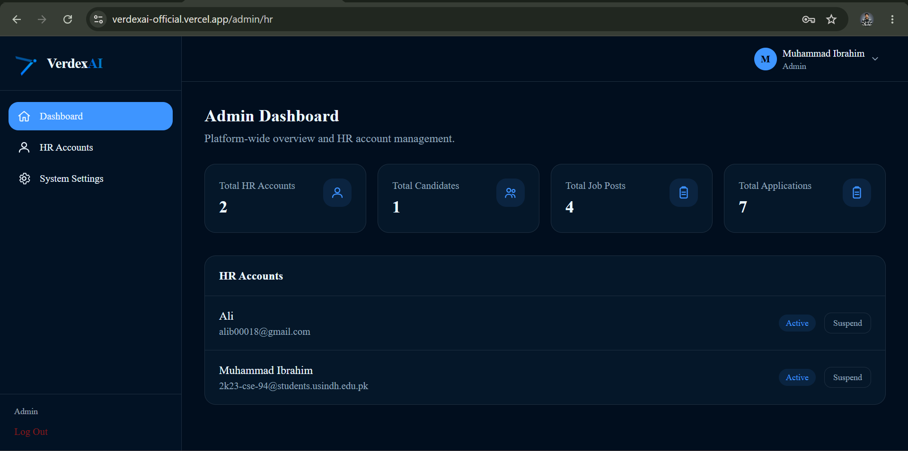

---

### Managing HR Accounts

Below the stats, all HR accounts are listed.

**To suspend an HR account:**
1. Find the HR account in the list
2. Click **Suspend**
3. Status changes to **Suspended** (red badge)
4. The HR user cannot perform HR actions while suspended

**To reactivate:**
1. Click **Activate** on a suspended account
2. Status returns to **Active** (blue badge)

  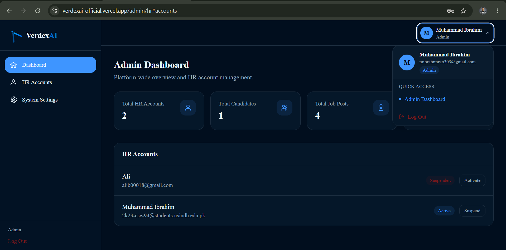

> **Note:** Admin accounts cannot be suspended through this interface. Only HR and Candidate accounts can be managed here.

---

## Contact & Support

If you encounter any issues, have questions, or simply want to get in touch, VerdexAI provides a built-in contact form on the landing page as well as direct communication channels to the developer.The contact form is located at the bottom of the landing page under the **Get In Touch** section. It is available to everyone — no login required.

**How to submit a message:**

1. Scroll to the **Get In Touch** section on the landing page
2. Fill in the following fields:
   - **Your Name** — enter your full name
   - **Your Email** — enter a valid email address so the developer can reply to you
   - **Subject** — briefly describe the reason for your message
   - **Message** — write your full message, question, or issue description
3. Click **Send Message**
4. The button changes to a loading state while your message is being sent
5. A green success banner appears confirming your message was received

  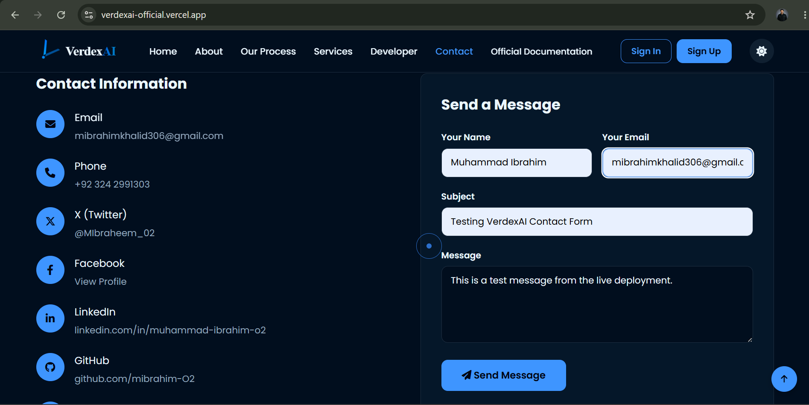

> **What happens next:** Your message is delivered directly to the developer's inbox via the Resend email API. You will receive a personal reply at the email address you provided.

---

### What the Developer Receives

When you submit the contact form, an automatically formatted email is delivered to the developer containing your name, your email address (set as reply-to for easy response), your subject line, and your full message.

  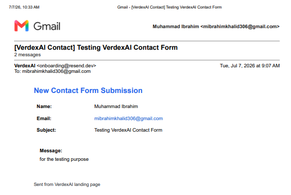

> The developer typically responds within 24–48 hours.

---

### Direct Contact Channels

**Muhammad Ibrahim — Developer**

Prefer to reach out directly? Use any of the channels below:

| Channel | Details |
|---------|---------|
| **Email** | [mibrahimkhalid306@gmail.com](mailto:mibrahimkhalid306@gmail.com) |
| **Phone** | [+92 324 2991303](tel:+923242991303) |
| **LinkedIn** | [linkedin.com/in/muhammad-ibrahim-o2](https://linkedin.com/in/muhammad-ibrahim-o2) |
| **GitHub** | [github.com/mibrahim-O2](https://github.com/mibrahim-O2) |
| **X (Twitter)** | [@MIbraheem_02](https://x.com/MIbraheem_02) |
| **Facebook** | [View Profile](https://www.facebook.com/profile.php?id=100085369586705) |
| **Location** | Jamshoro, Sindh, Pakistan, Remote Friendly |

---

### When Reporting a Bug

To help resolve issues as quickly as possible, please include the following in your message:

- Your **role** in the platform (Candidate, HR, or Admin)
- The **browser and device** you were using
- The **exact page URL** where the issue occurred
- A description of **what you expected** vs. **what actually happened**
- Any **error messages** visible on screen (a screenshot helps greatly)

**Or use the Contact Form on the live platform:**
[https://verdexai-official.vercel.app/#contact](https://verdexai-official.vercel.app/#contact)
---

  
   
  VerdexAI User Guide · Built and maintained independently by Muhammad Ibrahim · 2026

