

  

**[Live Platform →](https://verdexai-official.vercel.app)**&ensp;|&ensp;**[Back to README →](./README.md)**

---

## Table of Contents

- [Introduction](#introduction)
- [Getting Started](#getting-started)
  - [Creating an Account](#creating-an-account)
  - [Logging In](#logging-in)
  - [Forgot Password](#forgot-password)
- [Candidate Guide](#candidate-guide)
  - [Dashboard Overview](#candidate-dashboard-overview)
  - [Browsing Jobs](#browsing-jobs)
  - [Applying to a Job](#applying-to-a-job)
  - [My Tests](#my-tests)
  - [Taking an Assessment Test](#taking-an-assessment-test)
  - [Viewing Test Results](#viewing-test-results)
  - [Interview Details](#interview-details)
  - [Onboarding](#candidate-onboarding)
- [HR Guide](#hr-guide)
  - [Dashboard Overview](#hr-dashboard-overview)
  - [Creating a Job Post](#creating-a-job-post)
  - [Managing Job Posts](#managing-job-posts)
  - [Ranked Candidates](#ranked-candidates)
  - [Sending Assessment Tests](#sending-assessment-tests)
  - [Scheduling Interviews](#scheduling-interviews)
  - [Finalizing a Hire](#finalizing-a-hire)
  - [Onboarding Management](#onboarding-management)
- [Admin Guide](#admin-guide)
  - [Admin Dashboard](#admin-dashboard)
  - [Managing HR Accounts](#managing-hr-accounts)
- [Contact & Support](#contact--support)

---
## Introduction

VerdexAI is an AI-powered recruitment platform that streamlines the entire hiring process from posting a job to onboarding a hired candidate using intelligent CV parsing, automated scoring, assessment testing, and interview scheduling.

### Who is this guide for?

| Role | Description |
|------|-------------|
| **Candidate** | Job seekers who apply to positions, take assessments, and track their applications |
| **HR / Recruiter** | Hiring managers who post jobs, review AI-ranked candidates, and manage the hiring pipeline |
| **Admin** | Platform administrators who manage HR accounts and view system statistics |

---

## Getting Started

### Creating an Account

1. Visit [https://verdexai-official.vercel.app](https://verdexai-official.vercel.app)
2. Click **Sign Up** in the navigation bar ***See the screenshot below ↓***

  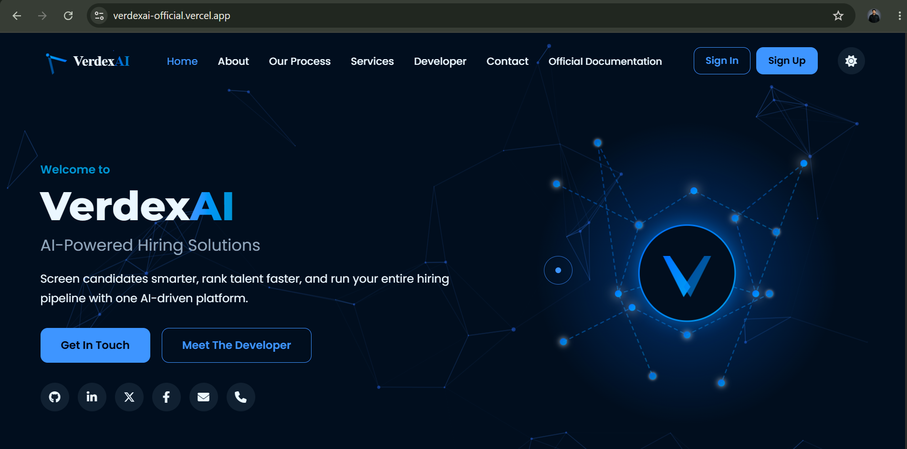

3. Fill in the registration form:
   - **Full Name** — your real name
   - **Email** — a valid email address you have access to
   - **I am a** — select your role:
     - **Candidate** — if you are looking for a job
     - **HR / Recruiter** — if you are hiring
   - **Password** — minimum 8 characters (use the strength indicator as a guide)
   - **Confirm Password** — must match exactly  ***See the screenshot below ↓***

  

  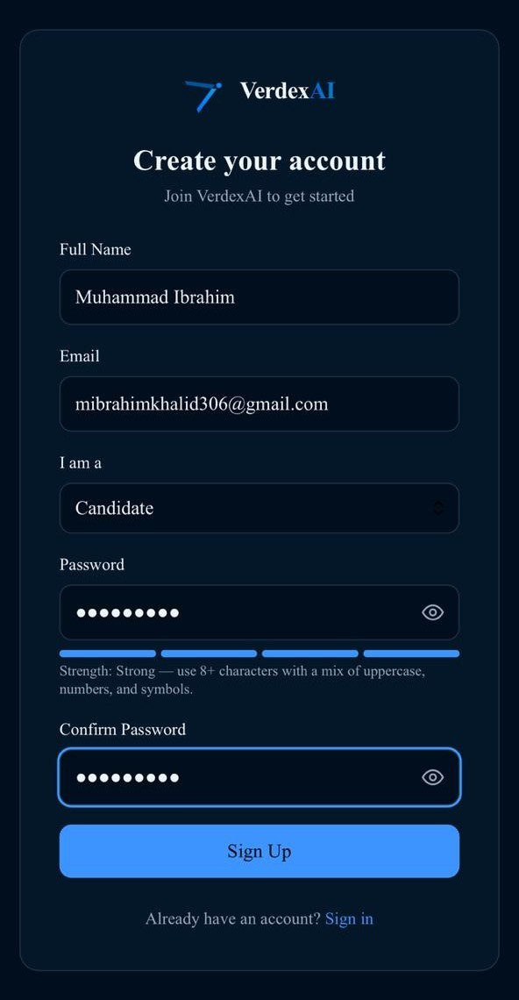

4. Click **Sign Up**
5. You will be automatically redirected to your role-specific dashboard

> **Note:** *Admin accounts are not self-registered. Contact the platform owner if you need admin access.*

--- 

### Logging In

1. Click **Sign In** in the navigation bar
2. Enter your registered email and password
3. Click **Sign In**
4. You will be redirected to your dashboard based on your role:
   - **Candidate** → `/candidate/dashboard`
   - **HR** → `/hr/dashboard`
   - **Admin** → `/admin/hr`

  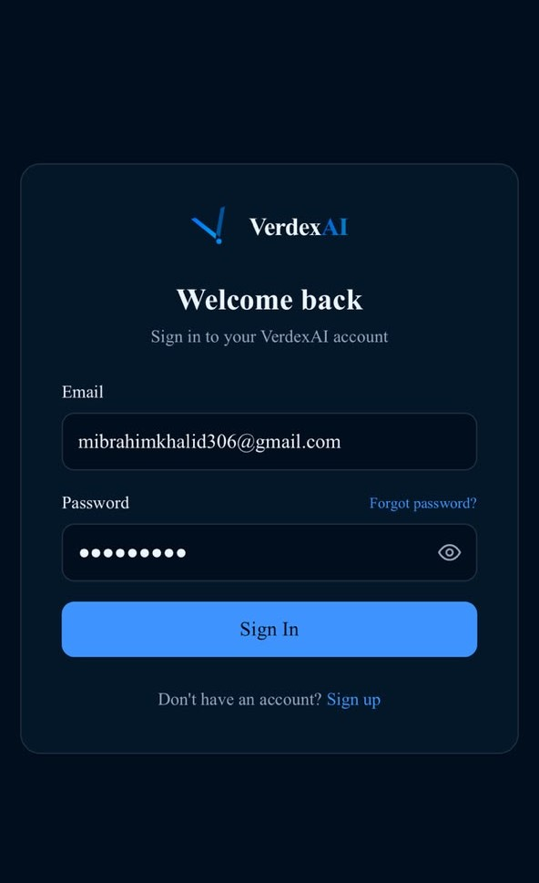

---

### Forgot Password

1. On the login page, click **Forgot password?**
2. Enter your registered email address
3. Click **Send Reset Link**
4. Check your inbox for a password reset email from VerdexAI
5. Click the link in the email and set a new password

  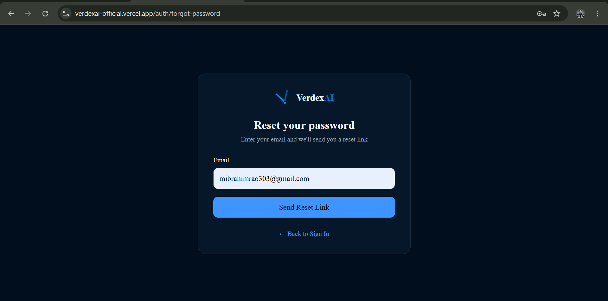

  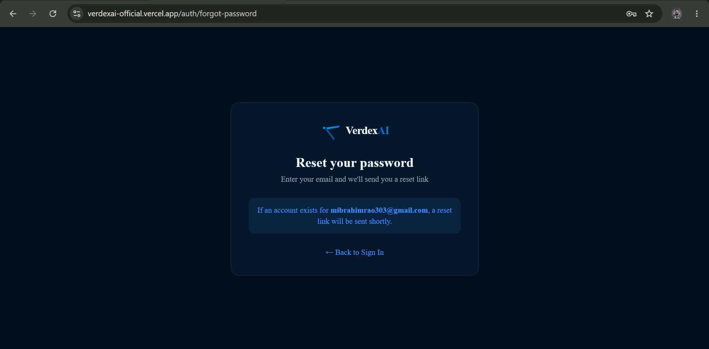

  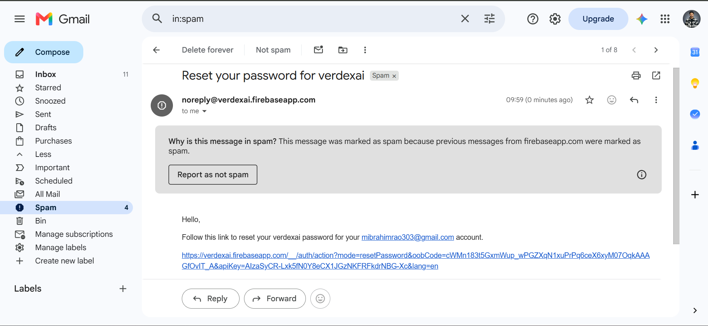

---

## Candidate Guide

### Candidate Dashboard Overview

After logging in, you will see your personal dashboard showing:

| Widget | Description |
|--------|-------------|
| **Applications Sent** | Total number of jobs you have applied to |
| **Shortlisted** | Applications where HR has shortlisted you |
| **Interviews** | Scheduled interviews you have upcoming |
| **Hired** | Positions where you have been hired |

Below the stats:
- **Upcoming Interviews** — shows any scheduled interviews with date, time, platform, and meeting link
- **All Applications** — complete list of your applications with current status

  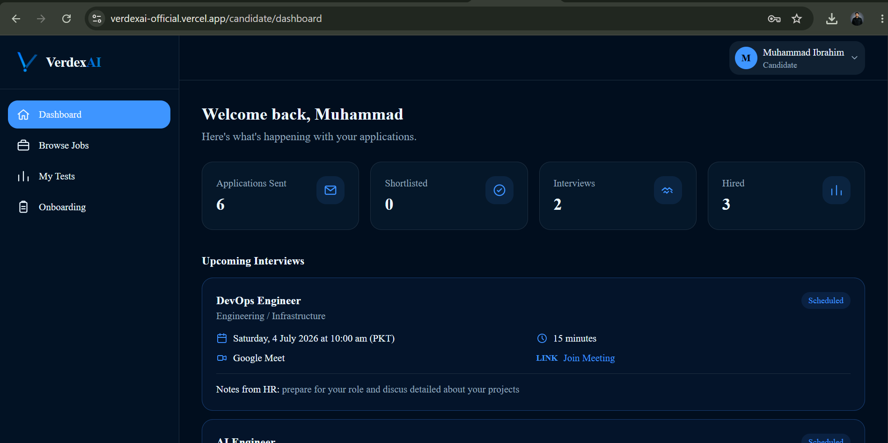

  
  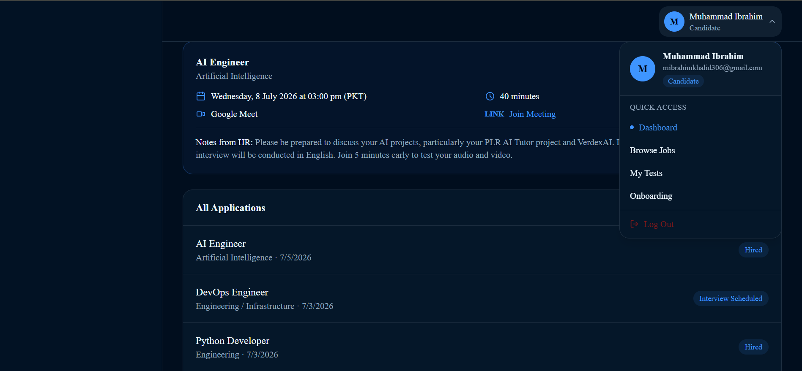

---

### Browsing Jobs

1. Click **Browse Jobs** in the left sidebar
2. All open job positions are displayed as cards showing:
   - Job title
   - Department
   - Brief description preview
3. If you have previously applied with a CV, your **AI-Extracted Profile** will appear at the top showing your skills, experience, and education as parsed by the AI

  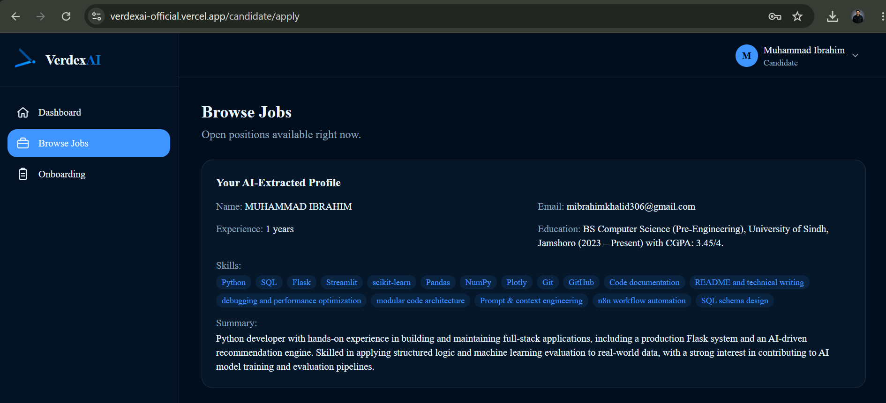

  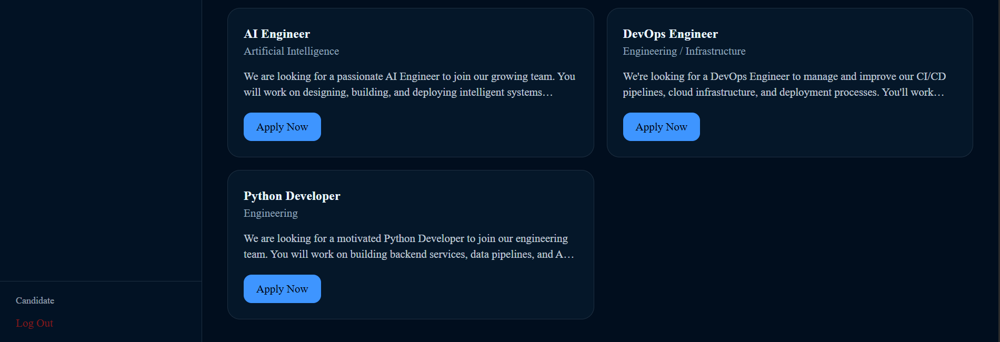

---
### Applying to a Job

1. On the Browse Jobs page, click **Apply Now** on any job card
2. You will see the full job description and requirements
3. Complete the application form:

   **Upload CV (PDF)**
   - Click the file input and select your resume as a PDF file
   - Maximum file size: 5MB
   - Your CV will be automatically parsed by AI to extract your skills, experience, and education
   - This extracted data is used to generate your match score against the job requirements

   **Cover Letter**
   - Write a personalized cover letter explaining why you are a good fit
   - This is optional but strongly recommended

4. Click **Submit Application**
5. A success message will appear: *"Application submitted! Your CV is being analyzed by AI"*
6. You will be automatically redirected to your dashboard after a few seconds

  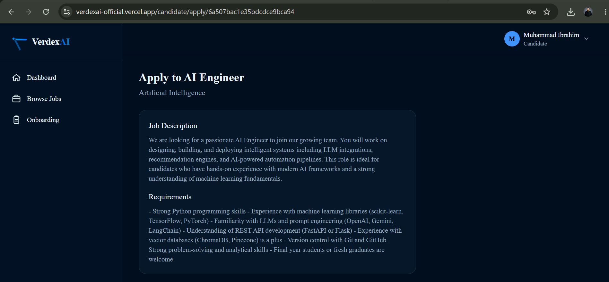
  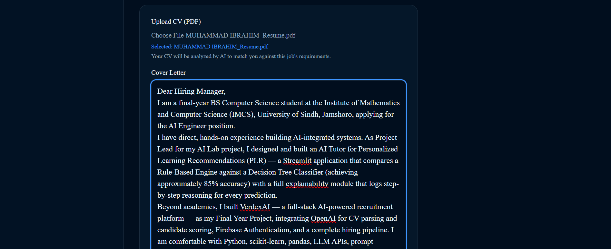
  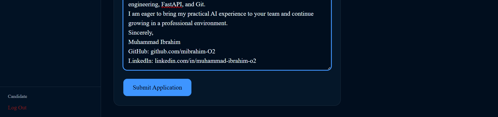

> **How AI Scoring Works:** Once you submit, VerdexAI sends your CV text and the job requirements to OpenAI. The AI extracts your profile and generates a match score (0–100%) with a reasoning explanation. This score is visible to the HR team on their ranked candidates list.

---

### My Tests

When HR sends you an assessment test, it appears in your **My Tests** section.

1. Click **My Tests** in the left sidebar
2. You will see all test invitations with:
   - Job title
   - Time limit
   - Expiry date
   - Status (Pending / Completed / Expired)
3. Click **Start Test** to begin a pending test  

  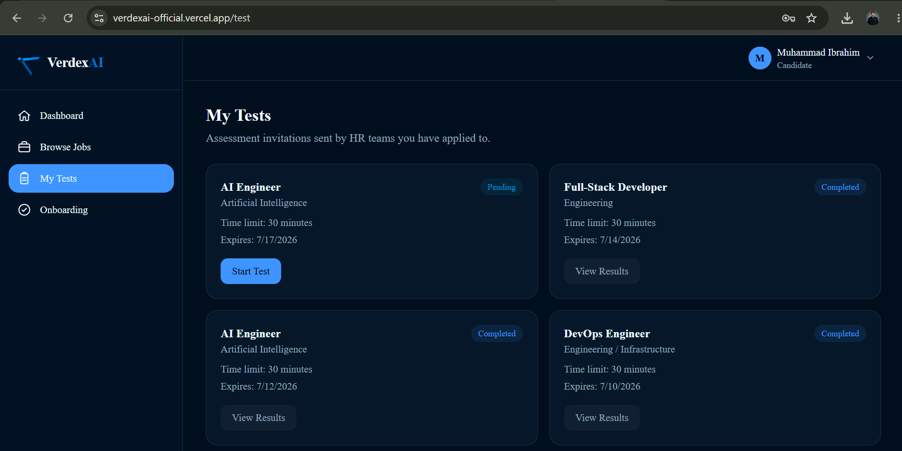

> **Important:** Tests expire after 7 days from when they were sent. Complete them before the expiry date.

---

### Taking an Assessment Test

1. Click **Start Test** on a pending invitation
2. The test opens in a focused interface showing:
   - Job title in the top bar
   - Countdown timer (top right — turns red when under 2 minutes)
   - Tab switch counter (increases if you switch browser tabs)
   - Question progress bar

3. **Answering Questions:**
   - Read the question carefully
   - Click one of the four options (A, B, C, D) to select your answer
   - Selected answers are highlighted in blue
   - Use **Previous** and **Next** buttons to navigate between questions
   - Use the numbered dots below to jump directly to any question
   - Answered questions show as filled dots, unanswered as empty

  

  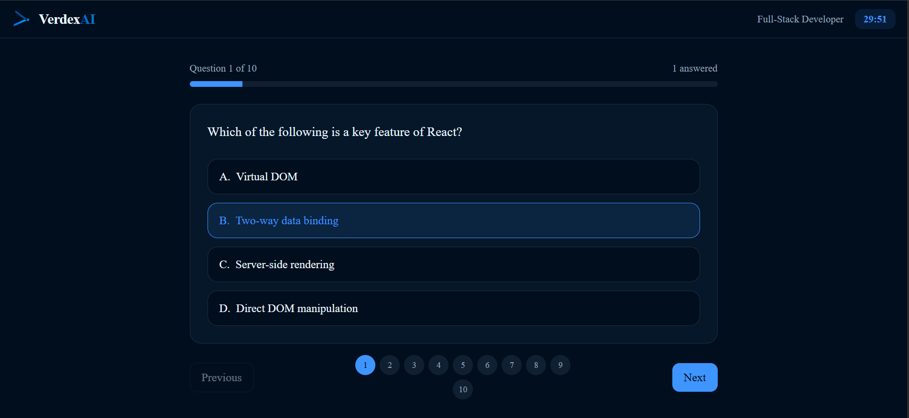

4. **Submitting:**
   - Click **Submit Test** on the last question (or any question using the submit button)
   - If you have unanswered questions, a confirmation prompt appears
   - The test auto-submits when the timer reaches zero

5. **Proctoring:** The system tracks how many times you switch browser tabs. Keep the test tab active throughout.

> **Important:** You can only submit a test once. Once submitted, you cannot retake it.

---

### Viewing Test Results

After submitting, you are redirected to the results page showing:

- **Score percentage** — large display (green if ≥60%, red if below)
- **Correct/Total** — e.g. "7 out of 10 correct"
- **Time Taken** — total time you spent
- **Tab Switches** — number of times you switched away from the test tab

Click **Review Answers** to see a detailed breakdown:
- Each question displayed with all four options
- **Correct answer** highlighted in blue with "(Correct)" label
- **Your wrong answers** highlighted in red with "(Your answer)" label
- **Explanation** shown below each question explaining the correct answer

  

---

### Interview Details

When HR schedules an interview, you receive:

1. **Email notification** — sent automatically to your registered email with:
   - Interview date and time (PKT timezone)
   - Duration
   - Platform (Google Meet, Zoom, Microsoft Teams, or Other)
   - Meeting link (clickable)
   - Notes from HR

2. **Dashboard card** — visible in the **Upcoming Interviews** section on your dashboard showing all the same details, with a **Join Meeting** link

  

> **Tip:** Save the meeting link before the interview day. Join 5 minutes early to test your audio and video.

  Candidate Received Email
  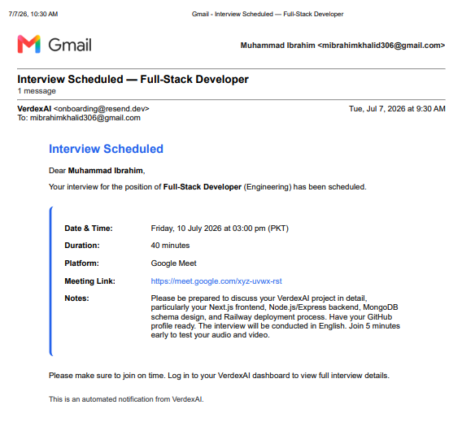

---

### Candidate Onboarding

After being hired, your onboarding checklist becomes visible.

1. Click **Onboarding** in the left sidebar
2. Your onboarding card shows:
   - Role and department you were hired for
   - Start date (if set by HR)
   - Progress bar showing overall completion
   - Individual steps with green checkmarks for completed ones:
     - Offer Letter Sent
     - Offer Accepted
     - Documents Submitted
     - IT Account Setup
     - First Day Scheduled

  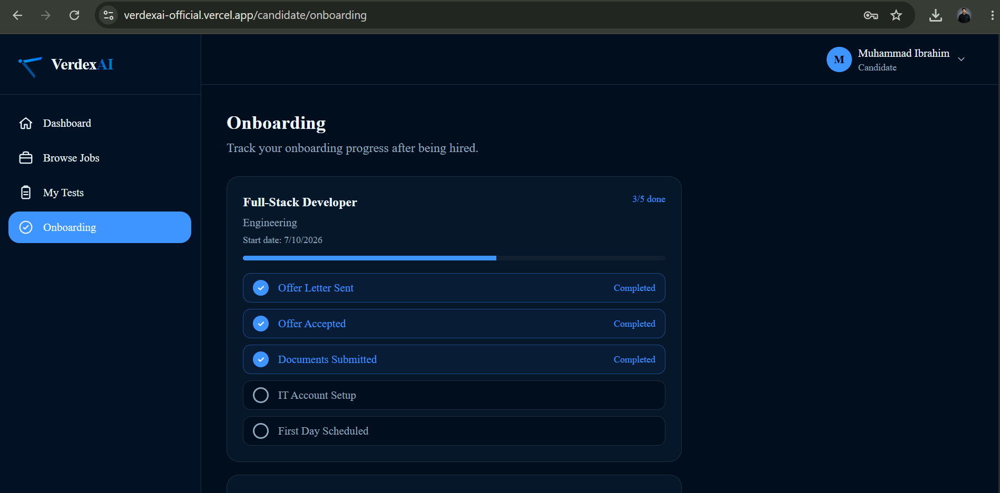

> **Note:** The steps are updated by your HR team. You cannot toggle them yourself — contact HR if there is a discrepancy.

---

# *HR part Processing...*
